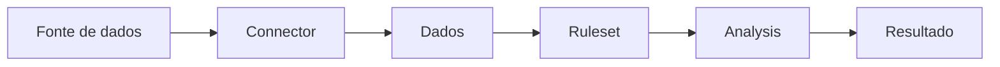

# Guia de arquitetura do cliente

Conteúdo técnico preservado do perfil institucional anterior. Os exemplos de métricas, campos e árvores abaixo são ilustrativos, não um inventário de funcionalidades implementadas. O catálogo atual está no [Organization Index](../brain/INDEX.md); o [Rulebook](../RULEBOOK.md) e o [Standard](../WORK_BRAIN_STANDARD.md) definem a versão V2. Preserve caminhos existentes ao aplicar este guia.

## 📐 Rulesets

Cada cliente possui um **ruleset próprio**, que funciona como a fonte estruturada de conhecimento compartilhado entre suas análises.

O ruleset concentra definições e regras que devem permanecer consistentes independentemente da análise executada.

| Categoria | Exemplos |
|---|---|
| **Identificação** | aliases, IDs e nomenclaturas do cliente |
| **Dados** | mappings de campos, normalizações e classificações |
| **Regras de negócio** | definição de acordo, critérios específicos, políticas |
| **Thresholds** | limites financeiros, faixas e critérios de decisão |
| **Classificações** | categorias, tags, prioridades e status |
| **Exceções** | situações que modificam ou sobrescrevem regras padrão |

Exemplo:

```text
Ruleset Zamp
     │
     ├── Agreement Count
     ├── Average Agreement Value
     ├── Provision Analysis
     └── Risk Analysis
```

A regra prática é:

> **Se uma definição precisa permanecer igual entre várias análises do mesmo cliente, ela provavelmente pertence ao ruleset.**

### Ruleset não é Analysis

```text
"Status homologado é considerado acordo."
                    │
                    ▼
                 RULESET
```

```text
"Quantos acordos ocorreram?"
                    │
                    ▼
                 ANALYSIS
```

Também não deve ser confundido com prompt ou connector:

```text
Ruleset
→ conhecimento e regras

Analysis
→ pergunta que queremos responder

Connector
→ como os dados são obtidos

Prompt
→ como uma LLM deve trabalhar
```

---

## 📊 Analyses

Uma **analysis** representa uma pergunta, problema ou resultado específico que queremos produzir dentro do contexto de um cliente.

Exemplos:

```text
Quantos acordos ocorreram?

Qual o valor médio dos acordos?

Qual a taxa de acordo?

Qual o volume de processos?

Qual a exposição financeira?

Quais processos apresentam maior risco?
```

Para novas unidades, a localização usual é a seguinte. Unidades existentes devem manter seus caminhos reais e receber BRAIN.md junto ao código:

```text
analyses/
```

Exemplo:

```text
work-brain-zamp/
│
└── analyses/
    ├── agreement_count/
    │   ├── README.md
    │   └── analysis.py
    │
    ├── average_agreement_value/
    │   ├── README.md
    │   └── analysis.py
    │
    └── risk_analysis/
        ├── README.md
        └── analysis.py
```

Cada análise reutiliza, sempre que aplicável, o mesmo ruleset e a mesma infraestrutura do cliente.

---

## 🔌 Connectors

Connectors são responsáveis exclusivamente por acessar fontes de dados.

Exemplos:

```text
Metabase
PostgreSQL
API interna
CSV
Google Sheets
```

O fluxo esperado é:



Um connector deve saber:

> **Como buscar os dados?**

Ele não deve decidir:

> **O que é um acordo?**
> **Qual processo é de alto risco?**
> **Qual regra específica do cliente deve ser aplicada?**

Essas responsabilidades pertencem ao ruleset e à análise.

---

## 🏗️ Estrutura padrão de um cliente

Um repositório deve seguir aproximadamente:

```text
work-brain-<client>/
│
├── README.md
├── pyproject.toml
├── .env.example
├── .gitignore
│
├── ruleset/
│   ├── README.md
│   └── <client>.yaml
│
├── analyses/
│   ├── README.md
│   │
│   ├── analysis_a/
│   │   ├── README.md
│   │   └── analysis.py
│   │
│   └── analysis_b/
│       ├── README.md
│       └── analysis.py
│
├── src/
│   └── work_brain/
│       ├── config.py
│       ├── ruleset.py
│       └── connectors/
│
├── prompts/
│
├── docs/
│
├── fixtures/
│
└── tests/
```

O `README.md` do cliente deve ser o **ponto inicial para qualquer pessoa ou agente que precise trabalhar naquele contexto**.

---

## 🧭 Onde cada coisa deve ficar?

| Pergunta | Lugar |
|---|---|
| Mudou porque mudou o cliente? | `ruleset/` |
| Mudou porque mudou a pergunta? | `analyses/` |
| Mudou porque mudou a fonte de dados? | `connectors/` |
| É instrução para uma LLM? | `prompts/` |
| É documentação complementar? | `docs/` |
| É código realmente compartilhado? | `src/` |
| É validação de comportamento? | `tests/` |

Em forma resumida:

```text
Mudou o cliente?
→ RULESET

Mudou a pergunta?
→ ANALYSIS

Mudou a fonte?
→ CONNECTOR

Mudou a instrução para IA?
→ PROMPT

É explicação?
→ DOCS
```

---

## 📋 Contrato mínimo de um repositório

Cada cliente deve documentar:

| Área | O que deve estar definido |
|---|---|
| **Contexto** | quem é o cliente e qual o contexto da operação |
| **Ruleset** | conhecimento e regras compartilhadas |
| **Dados** | fontes, schemas e mappings utilizados |
| **Análises** | perguntas e soluções disponíveis |
| **Prompts** | instruções para LLMs, quando aplicável |
| **Saídas** | estrutura e significado dos resultados |
| **Validação** | como verificar regras e análises |
| **Limitações** | situações não contempladas ou que exigem revisão humana |

---

## 🚀 Criando uma nova análise

Uma análise nova deve nascer **dentro do repositório do cliente**.

```text
Cliente
   ↓
Problema / pergunta
   ↓
Dados
   ↓
Ruleset
   ↓
Analysis
   ↓
Validação
   ↓
Resultado
```

Por exemplo:

```text
work-brain-zamp/
│
└── analyses/
    └── agreement_count/
```

e não:

```text
zamp-agreement-count/
```

como um novo repositório.

Para instruções completas sobre criação de análises e novos clientes, consulte o **[Work Brain Rulebook](https://github.com/work-brain-trabalhista/.github/blob/main/RULEBOOK.md)**.

---

## 🧭 Princípios

> **Context before analysis.**
> Primeiro entenda o cliente e o contexto. Depois aplique regras e execute a análise.

> **Explicit rules over implicit knowledge.**
> Conhecimento importante não deve existir apenas na cabeça de quem escreveu o código.

> **One client, one source of truth.**
> As regras compartilhadas de um cliente devem possuir uma fonte de verdade clara.

> **Analyses should be reproducible.**
> Deve ser possível compreender quais dados, regras e versões produziram determinado resultado.

> **Documentation is part of the product.**
> Uma análise que apenas seu autor entende ainda não está pronta.

> **Prefer simple structures.**
> Não transformar o Work Brain em um framework antes que exista necessidade real.

---

## 🔐 Segurança e confidencialidade

Os repositórios podem conter conhecimento interno relacionado às operações de contencioso trabalhista.

Nunca devem ser versionados:

- credenciais;
- API keys;
- tokens;
- senhas;
- arquivos `.env`;
- dados pessoais desnecessários;
- documentos processuais completos sem necessidade;
- informações confidenciais fora do escopo da análise.

Exemplos e testes devem utilizar, sempre que possível, **dados fictícios ou anonimizados**.

---
