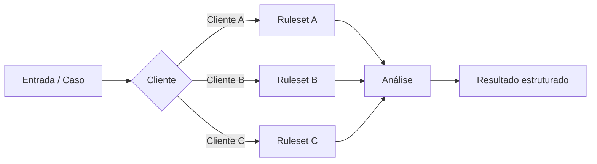
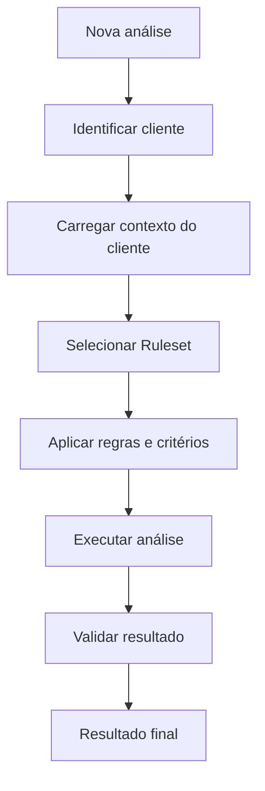
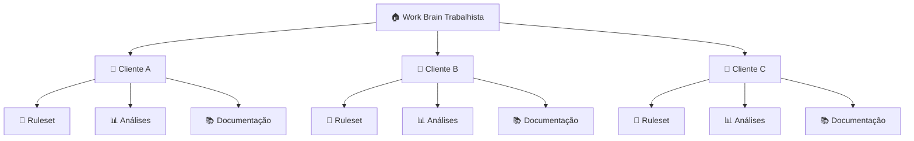

<div align="center">

# ⚖️ Work Brain · Trabalhista

### Inteligência, padronização e conhecimento aplicado ao contencioso trabalhista

Repositório central de conhecimento e navegação para análises trabalhistas estruturadas por cliente.

</div>

---

## 🧠 Sobre o Work Brain

O **Work Brain Trabalhista** organiza conhecimento, regras e análises relacionadas ao contencioso trabalhista de forma estruturada, reproduzível e específica para cada cliente.

A organização funciona como uma camada central de inteligência: cada cliente possui seu próprio contexto, critérios, particularidades processuais e regras de análise.

Por isso, o conhecimento não é tratado como uma única regra universal.

Cada análise é executada a partir de um **ruleset específico**, selecionado de acordo com o cliente ao qual o caso pertence.



---

## 🗂️ Clientes

Cada cliente possui um repositório próprio contendo seu contexto, regras, análises e documentação.

| Cliente | Repositório | Ruleset | Status |
|---|---|---|---|
| **Cliente A** | [`cliente-a`](../cliente-a) | `ruleset_cliente_a` | 🟢 Ativo |
| **Cliente B** | [`cliente-b`](../cliente-b) | `ruleset_cliente_b` | 🟢 Ativo |
| **Cliente C** | [`cliente-c`](../cliente-c) | `ruleset_cliente_c` | 🟡 Em desenvolvimento |

> Cada repositório possui seu próprio `README.md` com documentação detalhada sobre contexto, regras de negócio, fontes de dados, análises disponíveis e particularidades daquele cliente.

---

## 🧩 Como o conhecimento é organizado

A arquitetura do Work Brain separa o que é **comum ao domínio trabalhista** daquilo que é **específico de cada cliente**.

```text
work-brain-trabalhista/
│
├── cliente-a/
│   ├── README.md
│   ├── ruleset/
│   ├── analyses/
│   ├── prompts/
│   ├── docs/
│   └── examples/
│
├── cliente-b/
│   ├── README.md
│   ├── ruleset/
│   ├── analyses/
│   ├── prompts/
│   ├── docs/
│   └── examples/
│
└── .github/
    └── profile/
        └── README.md      ← você está aqui
```

### Fluxo de análise



---

## 📐 Rulesets

Um **ruleset** representa o conjunto de regras, critérios e interpretações necessárias para analisar casos de determinado cliente.

Ele pode contemplar, por exemplo:

| Categoria | Exemplos |
|---|---|
| **Regras jurídicas** | teses, critérios processuais, entendimentos aplicáveis |
| **Regras do cliente** | estratégias, políticas internas e critérios específicos |
| **Classificação** | categorias, tags, risco, probabilidade e prioridade |
| **Dados** | campos obrigatórios, normalizações e tratamentos |
| **Análise** | critérios utilizados para chegar às conclusões |
| **Saída** | estrutura esperada para relatórios e resultados |

O objetivo é garantir que uma análise realizada para um cliente utilize **exatamente o contexto e os critérios daquele cliente**, evitando que regras sejam aplicadas indevidamente entre operações diferentes.

---

## 🏗️ Estrutura de um repositório de cliente

Cada repositório deve funcionar como uma unidade autossuficiente de conhecimento.

Exemplo:

```text
cliente-x/
│
├── README.md
│
├── ruleset/
│   ├── README.md
│   ├── rules.yaml
│   └── definitions.md
│
├── analyses/
│   ├── analysis_a/
│   └── analysis_b/
│
├── prompts/
│
├── docs/
│
├── examples/
│
└── tests/
```

O `README.md` do cliente deve ser o **ponto inicial para qualquer pessoa ou agente que precise trabalhar naquele contexto**.

---

## 🔎 Navegação



---

## 📋 Contrato mínimo de cada repositório

Para manter o Work Brain consistente, cada repositório de cliente deve documentar:

| Área | O que deve estar definido |
|---|---|
| **Contexto** | quem é o cliente e qual problema está sendo analisado |
| **Escopo** | quais processos, documentos ou situações estão contemplados |
| **Ruleset** | regras utilizadas nas análises |
| **Dados** | fontes e estrutura das informações utilizadas |
| **Análises** | quais análises estão disponíveis |
| **Saídas** | formato e significado dos resultados |
| **Validação** | como verificar se a análise está funcionando corretamente |
| **Limitações** | situações não contempladas ou que exigem revisão humana |

---

## 🧭 Princípios

> **Contexto antes de análise.**  
> Nenhuma regra deve ser aplicada sem identificar primeiro o cliente e o contexto ao qual a análise pertence.

> **Rulesets são explícitos.**  
> Critérios relevantes não devem depender apenas de conhecimento implícito de quem desenvolveu a análise.

> **Análises devem ser reproduzíveis.**  
> Deve ser possível entender quais dados, regras e versões produziram determinado resultado.

> **Cliente é uma fronteira de conhecimento.**  
> Uma regra válida para um cliente não deve automaticamente ser considerada válida para outro.

> **Documentação faz parte da solução.**  
> Cada análise deve ser compreensível por pessoas que não participaram de sua criação.

---

## 🔐 Segurança e confidencialidade

Os repositórios desta organização podem conter conhecimento interno relacionado a operações de contencioso trabalhista.

Não devem ser adicionados ao código ou à documentação:

- credenciais, tokens ou secrets;
- dados pessoais desnecessários;
- documentos processuais completos quando não forem necessários;
- informações confidenciais fora do escopo da análise.

Sempre que possível, exemplos devem utilizar dados fictícios ou anonimizados.

---

## 🚀 Criando uma nova análise

Uma nova análise deve nascer dentro do repositório do cliente ao qual pertence.

```text
Cliente
   ↓
Ruleset
   ↓
Problema / hipótese
   ↓
Análise
   ↓
Validação
   ↓
Documentação
   ↓
Disponibilização
```

Quando uma solução demonstrar ser suficientemente genérica para múltiplos clientes, ela pode posteriormente ser abstraída para uma camada compartilhada.

---

<div align="center">

### Work Brain · Trabalhista

**Conhecimento estruturado → regras explícitas → análises reproduzíveis**

</div>
