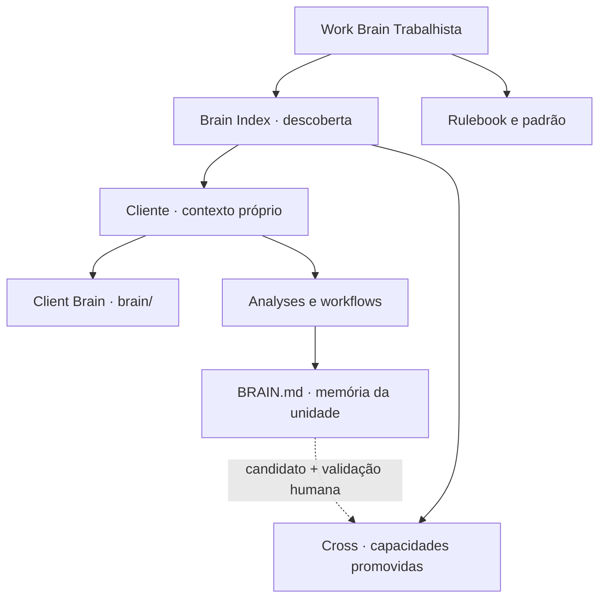

# ⚖️ Work Brain · Trabalhista

**Memória do trabalho, contexto por cliente e descoberta de conhecimento no contencioso trabalhista.**

O Work Brain organiza o que cada unidade faz, como funciona hoje, quais decisões importam e onde estão suas evidências. Pessoas e agentes conseguem retomar o trabalho pelo `BRAIN.md` da unidade, enquanto os índices permitem descobrir conhecimento sem carregar todos os repositórios.

> **Client contém contexto. Index conecta contexto. Cross contém conhecimento reutilizável.**

[Brain Index](https://github.com/Work-brain-Trabalhista/.github/blob/main/brain/INDEX.md) · [Rulebook](https://github.com/Work-brain-Trabalhista/.github/blob/main/RULEBOOK.md) · [Padrão Work Brain](https://github.com/Work-brain-Trabalhista/.github/blob/main/WORK_BRAIN_STANDARD.md)

## Como a arquitetura se organiza


```mermaid
flowchart TD
    ORG["Work Brain Trabalhista"] --> INDEX["Brain Index · descoberta"]
    ORG --> STANDARD["Rulebook e padrão"]
    INDEX --> CLIENT["Cliente · contexto próprio"]
    CLIENT --> MEMORY["Client Brain · brain/"]
    CLIENT --> UNITS["Analyses e workflows"]
    UNITS --> BRAIN["BRAIN.md · memória da unidade"]
    INDEX --> CROSS["Cross · capacidades promovidas"]
    BRAIN -. "candidato + validação humana" .-> CROSS
```

| Camada | Papel |
|---|---|
| **Client** | Mantém contexto e fonte de verdade em seu repositório |
| **Ruleset** | Concentra mappings e regras compartilhadas do cliente |
| **Analysis** | Responde uma pergunta ou produz um cálculo/análise |
| **Workflow** | Coordena múltiplas etapas ou uma transformação operacional |
| **Product** | Agrupa analyses/workflows quando existe um produto maior |
| **BRAIN.md** | Explica objetivo, funcionamento, regras, decisões, estado e evidências da unidade |
| **Client Brain** | Consolida contexto e mapa local em `brain/` |
| **Brain Index** | Localiza unidades, tópicos e memórias entre repositórios |
| **Cross** | Recebe somente capacidades independentes do cliente, após validação humana |

Connectors continuam responsáveis pelo acesso aos dados; prompts, pelas instruções de LLM quando necessários. As regras específicas permanecem no cliente.

## O que existe hoje

| Repositório | Função | Estado |
|---|---|---|
| [`.github`](https://github.com/Work-brain-Trabalhista/.github) | Control plane documental: padrão, Rulebook, auditoria e índice organizacional | Estrutura V2 implementada |
| [`work-brain-zamp`](https://github.com/Work-brain-Trabalhista/work-brain-zamp) | Primeiro cliente piloto, com memória por unidade e contexto consolidado | POC experimental; privado |
| [`work-brain-cross`](https://github.com/Work-brain-Trabalhista/work-brain-cross) | Destino controlado para reutilização futura | Estrutura inicial; privado; **0 itens promovidos** |

O índice organizacional vive em **`.github/brain/INDEX.md`**. Outros clientes serão catalogados quando existirem.

```text
Work-brain-Trabalhista
├── .github
│   ├── RULEBOOK.md
│   ├── WORK_BRAIN_STANDARD.md
│   ├── brain/INDEX.md
│   ├── brain/ORG_AUDIT.md
│   └── profile/README.md
├── work-brain-zamp
│   ├── brain/CLIENT.md
│   ├── brain/INDEX.md
│   ├── brain/CROSS_CANDIDATES.md
│   └── BRAIN.md junto às unidades existentes
└── work-brain-cross
    ├── brain/INDEX.md
    └── diretórios reservados para capacidades promovidas
```

## ZAMP como primeiro piloto

A POC possui duas analyses: **Agreement Count** e **Risk Analysis**. CLI, conector Metabase e ruleset completam as cinco unidades com memória própria. Nenhum workflow independente foi identificado neste checkout.

- [Client Brain](https://github.com/Work-brain-Trabalhista/work-brain-zamp/blob/main/brain/CLIENT.md): contexto consolidado.
- [Client Index](https://github.com/Work-brain-Trabalhista/work-brain-zamp/blob/main/brain/INDEX.md): unidades, caminhos e tópicos.
- [Cross Candidates](https://github.com/Work-brain-Trabalhista/work-brain-zamp/blob/main/brain/CROSS_CANDIDATES.md): sugestões, sem promoção automática.

As regras e os schemas atuais são fictícios; a integração com dados reais ainda não foi comprovada. Esses exemplos não representam resultados de negócio validados.

## Como descobrir conhecimento

```text
Pergunta: “já fizemos algo semelhante?”
                  ↓
       Organization Brain Index
                  ↓
     encontra unidade e repositório
                  ↓
         verifica acesso/permissão
                  ↓
     lê somente o BRAIN.md relevante
```

O índice público contém metadados de descoberta. O contexto privado permanece no repositório de origem, e os links não concedem acesso. Cross não serve como ponte para o contexto de outros clientes.

## Como conhecimento chega a Cross

Uma capacidade começa como candidato no `brain/CROSS_CANDIDATES.md` do cliente. A avaliação verifica reutilização concreta, dependências específicas, proveniência, contrato, testes e segurança. **Somente após validação humana explícita** ela pode ser promovida para Cross.

Nada da ZAMP foi movido automaticamente. Cross começa vazio; diretórios reservados não são funcionalidades implementadas.

## Agentes pessoais e Daily Ingest

**PLANEJADO — ainda não automatizado:**

```text
Pessoa trabalha no projeto autorizado
                  ↓
Agente pessoal identifica a unidade e atualiza BRAIN.md
                  ↓
Gate: allowlist + denylist + secret scan + revisão do diff
                  ↓
Commit e snapshot de preservação
                  ↓
Daily Ingest lê principalmente BRAIN.md alterados
                  ↓
Atualiza Client Brain e Organization Index
                  ↓
Sugere relações e candidatos a Cross
```

O agente atua no projeto autorizado, registra decisões com origem e prepara preservação segura. Promoções para Cross e mudanças institucionais exigem avaliação explícita. Nenhuma rotina noturna ou snapshot automático foi implementado nesta fase.

## Princípios e segurança

- **Contexto antes da análise:** entender o cliente antes de interpretar dados.
- **Regras explícitas:** manter uma fonte de verdade e preservar proveniência.
- **Reprodutibilidade:** registrar dados, regras, versões e limitações.
- **Memória concisa:** diferenciar IMPLEMENTADO, PLANEJADO e HIPÓTESE / DISCUSSÃO; não inventar informação.
- **Caminhos preservados:** primeiro fazer o Brain entender o código existente.
- **Confidencialidade:** nunca versionar credenciais, `.env`, dados pessoais desnecessários, dumps ou documentos processuais sem necessidade. Exemplos devem ser fictícios ou anonimizados.

## Documentação

- [Rulebook](https://github.com/Work-brain-Trabalhista/.github/blob/main/RULEBOOK.md): responsabilidades, descoberta, promoção e segurança.
- [Work Brain Standard](https://github.com/Work-brain-Trabalhista/.github/blob/main/WORK_BRAIN_STANDARD.md): contrato de memória e índices.
- [Organization Index](https://github.com/Work-brain-Trabalhista/.github/blob/main/brain/INDEX.md): catálogo atual.
- [Organization Audit](https://github.com/Work-brain-Trabalhista/.github/blob/main/brain/ORG_AUDIT.md): diagnóstico que orientou a adaptação.
- [Guia de arquitetura do cliente](https://github.com/Work-brain-Trabalhista/.github/blob/main/docs/CLIENT_ARCHITECTURE_GUIDE.md): regras, análises, connectors e convenções técnicas preservadas da documentação anterior.
